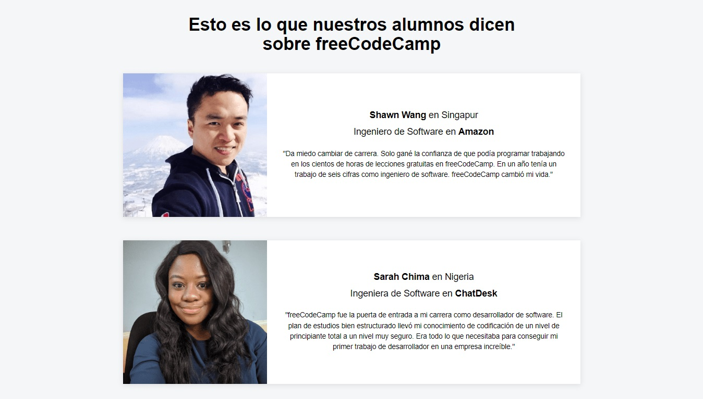

# Individual Project - React - Project Clone freeCodeCamp.

  

## Objetivos del Proyecto

- Clonar una onepage de freeCodeCamp.
- Afirmar y conectar los conceptos aprendidos sobre React.
- Aprender mejores prácticas.
- Aprender y practicar CSS.
- Projecto simple para afianzar conceptos básicos.
